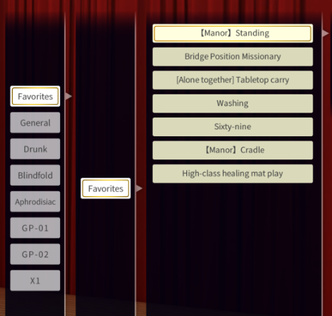
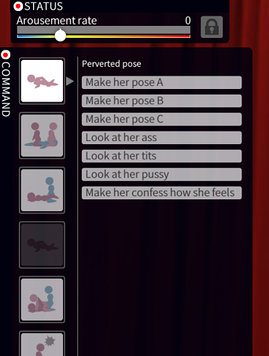

# FreeYotogiFavorites

Allows pinning favorite yotogi skills for quick access in memories mode. You may also enable history mode in order to show recently used skills in the playlist.

## Installing

Get the latest version from [the release page](../../releases/latest). Extract the archive contents into the root of your game directory.

## Usage

Shift-click skills in the skill tree to toggle favorite status. Favorite skills are highlighted in yellow.

## Configuration

Settings are stored in `BepInEx\config\net.perdition.com3d2.freeyotogifavorites.cfg` and can be modified using a text editor or a BepInEx configuration manager.
